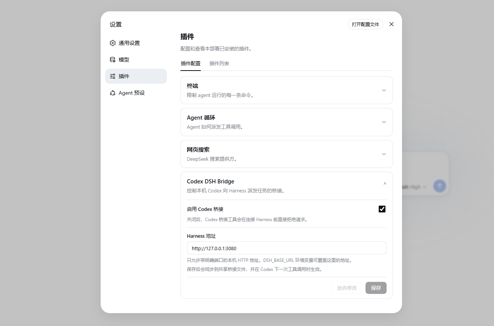

<div align="left">
  <h1>Codex DeepSeekHarness Bridge</h1>
  <p><strong>让 Codex 把本机项目任务派发给 DeepSeek Harness 会话,本仓库全部代码均由 Codex 生成。</strong></p>
  
</div>

---

## Overview

`codex-dsh-bridge` connects Codex to a locally running DeepSeek Harness WebUI through its HTTP RPC API.

The repository contains both sides of the integration:

- a Codex plugin with MCP tools and a collaboration skill;
- a DeepSeek Harness companion that adds bridge controls to Harness settings.

## Beginner one-click install

Requirements:

- Windows PowerShell 5.1 or PowerShell 7;
- Node.js 18 or newer;
- Codex CLI with plugin support;
- DeepSeek Harness with the `dsh` command available.

Download and run the installer:

```powershell
$installer = Join-Path $env:TEMP "codex-dsh-bridge-install.ps1"
Invoke-WebRequest "https://raw.githubusercontent.com/knottttt/codex-dsh-bridge/main/install.ps1" -OutFile $installer
powershell -ExecutionPolicy Bypass -File $installer
```

The installer:

1. adds or refreshes the Codex marketplace;
2. installs the Codex plugin;
3. installs the Harness companion into the `web` profile;
4. prints the required restart steps.

After installation:

1. restart the DeepSeek Harness WebUI;
2. start a new Codex task;
3. open `Settings → Plugins → Plugin configuration` in Harness;
4. confirm that **Codex DSH Bridge** is enabled.

## Manual installation

Run these commands if you prefer to review each action:

```powershell
codex plugin marketplace add knottttt/codex-dsh-bridge --ref main
codex plugin add codex-dsh-bridge@codex-dsh-bridge
dsh plugin --profile web add github:knottttt/codex-dsh-bridge#main
```

Restart Harness and start a new Codex task after the commands finish.

## Updating

Run the installer again. It refreshes the marketplace, reinstalls the Codex plugin, and updates the Harness package:

```powershell
powershell -ExecutionPolicy Bypass -File $installer
```

## Uninstalling

Download and run the uninstaller:

```powershell
$uninstaller = Join-Path $env:TEMP "codex-dsh-bridge-uninstall.ps1"
Invoke-WebRequest "https://raw.githubusercontent.com/knottttt/codex-dsh-bridge/main/uninstall.ps1" -OutFile $uninstaller
powershell -ExecutionPolicy Bypass -File $uninstaller
```

Saved bridge settings are preserved by default. Pass `-RemoveSettings` to remove them as well.

## Components

| Component | Location | Purpose |
| --- | --- | --- |
| Codex plugin | `.codex-plugin/`, `.mcp.json` | Registers the plugin and its local MCP server |
| MCP bridge | `scripts/` | Connects Codex tools to the DSH HTTP RPC API |
| Collaboration skill | `skills/` | Guides Codex when delegating work to DSH |
| Harness companion | `dsh-plugin/` | Adds bridge controls to Harness settings |
| Marketplace | `.agents/plugins/marketplace.json` | Makes the Codex plugin installable from GitHub |
| Installer | `install.ps1` | Installs and updates both sides of the bridge |

## Available Codex tools

- inspect the current DSH host;
- list and filter DSH sessions;
- create a session for a project;
- queue or steer a message;
- read clean user and final assistant messages;
- wait for bounded completion;
- cancel or fork a session;
- dispatch a task through one convenience tool.

## Harness settings

The companion adds a configuration card at:

```text
Settings → Plugins → Plugin configuration → Codex DSH Bridge
```

The card controls:

- whether the Codex bridge is enabled;
- which local Harness endpoint the bridge uses.

Settings are mirrored to:

```text
%DSH_HOME%\codex-dsh-bridge.json
```

When `DSH_HOME` is unset, the fallback location is:

```text
%USERPROFILE%\.dsh\codex-dsh-bridge.json
```

The MCP process reads this file for every tool call, so endpoint and enabled-state changes apply without restarting Codex. The optional `DSH_BASE_URL` environment variable overrides the saved endpoint, while the Harness enabled switch still takes priority.

## Local-only security boundary

The bridge accepts only loopback HTTP origins with an explicit port:

- `127.0.0.1`
- `localhost`
- `::1`

HTTPS, LAN addresses, credentials, URL paths, query parameters, and fragments are rejected.

## Troubleshooting

### Codex tools do not appear

Start a new Codex task. Plugins and MCP tools are loaded when a task starts.

### Harness settings card does not appear

Restart the Harness WebUI and verify the installed package:

```powershell
dsh plugin --profile web list --depth 0
```

The list should contain `codex-dsh-bridge-companion`.

### A required command is missing

Verify the commands independently:

```powershell
node --version
codex --version
dsh --version
```

### Install only one side

The installer supports:

```powershell
.\install.ps1 -SkipDsh
.\install.ps1 -SkipCodex
```

## Development

Run the complete test suite and package check from the repository root:

```powershell
npm test
npm run pack:check
```

The suite covers bridge configuration, endpoint validation, Harness settings, revision conflicts, client registration, and distribution metadata.
